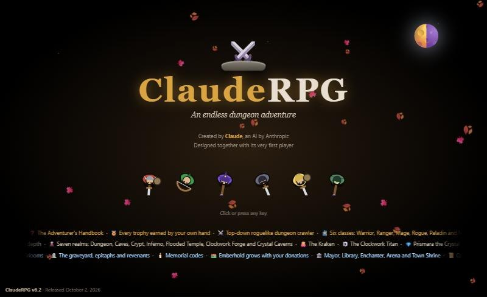
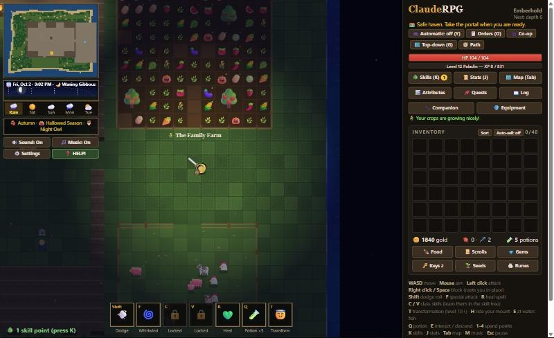
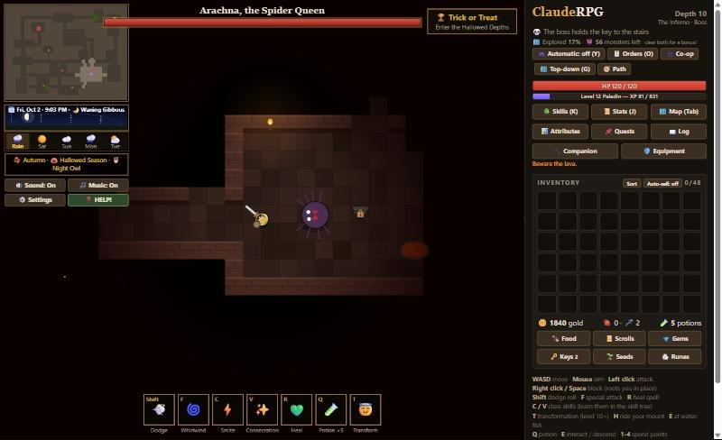
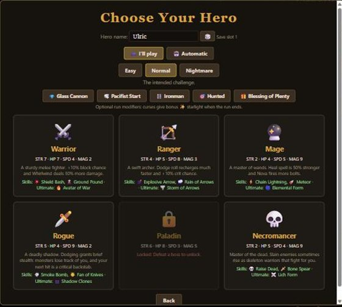
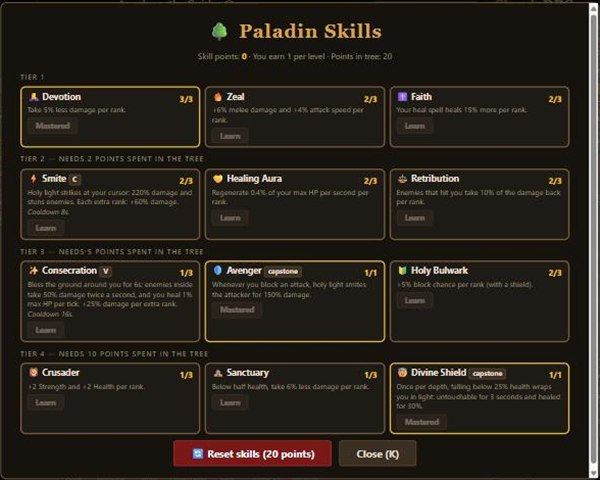
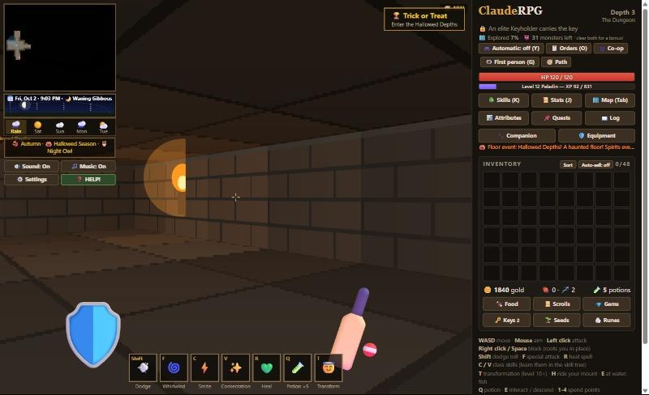
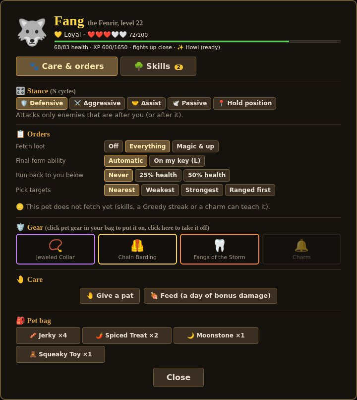
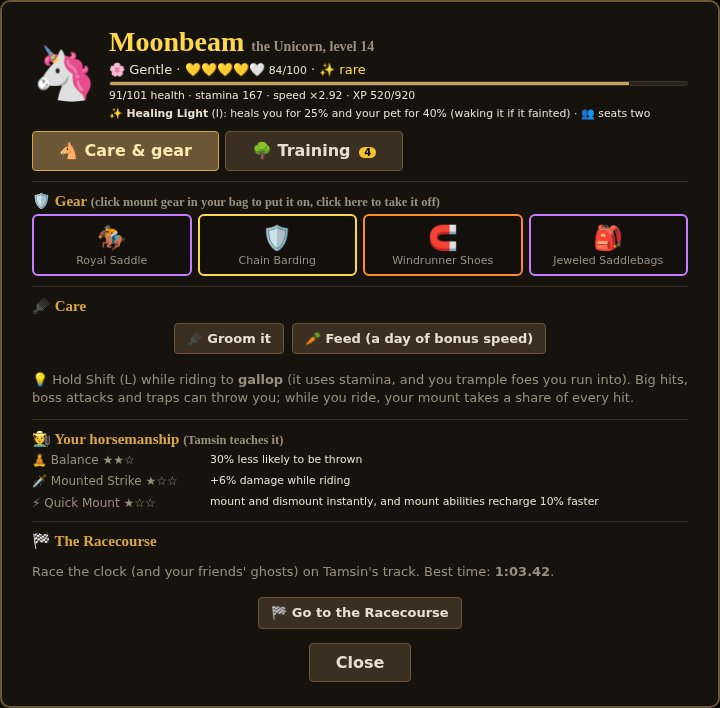

  

<h1 align="center">ClaudeRPG</h1>

  <b>A cozy, endless dungeon adventure that runs in your web browser.</b> 
  Fight your way down through the depths, then come home to your island town, your farm and your animals. 
  The whole game is a single HTML file. No install, no account, no internet needed.

  <a href="#-play-in-30-seconds">🚀 How to play</a> ·
  <a href="#-screenshots">📸 Screenshots</a> ·
  <a href="#-controls">🎮 Controls</a> ·
  <a href="#-whats-in-the-game">✨ Features</a> ·
  <a href="#-good-to-know">💡 Good to know</a>

---

## 🚀 Play in 30 seconds

1. Click **[ClaudeRPG v13.0.html](ClaudeRPG%20v13.0.html)** (the newest version, at the top of the file list), then click the **Download raw file** button (⬇️) near the top right of the file view.
2. Open the downloaded file in a web browser (Chrome, Edge, Firefox or Safari).
3. Press any key on the title card, pick **New Game**, choose a hero, and you're in!

New to the game? Pick **"Show me everything"** when it asks. The **🧭 Hero's Path** will guide you one short tip at a time, with a reward for every chapter.

---

## 🗺️ What kind of game is it?

ClaudeRPG is a **top-down action roguelike** with a warm, homey side.

- **⚔️ Delve:** every depth is a new randomly built floor. Find the **Floor Level Key** (lying around or carried by an elite *Keyholder*), then take the stairs down. Every fifth depth a **boss** guards the way.
- **🏘️ Come home:** read a Return Scroll and you're back in **Emberhold**, a safe town on an island. Sell loot, repair and upgrade your gear, cook, fish, and talk to the townsfolk.
- **🌾 Build a life:** your family has a **farm**, a **livestock pen**, a **stable** and a **kennel**. Crops grow in real time, even while the game is closed.
- **💀 Permadeath, with a legacy:** when a hero falls, they're gone, but the **family** carries on. The farm, the town you helped build, your achievements and your discoveries stay for the next hero in the bloodline.

---

## 📸 Screenshots

| | |
|:---:|:---:|
|  **Emberhold at night:** the family farm and the livestock pen |  **Boss fight:** Arachna, the Spider Queen, in the Inferno |
|  **Six classes** to choose from (some unlock as you play) |  **Skill trees:** four tiers, three choices each |
|  **Three views:** top-down, first person, or retro ASCII |  **The Pet Den:** stances, orders, pet gear, treats and a skill tree for every pet |
|  **The Mount Den:** mount gear, training, your horsemanship and the racecourse | |

---

## 🧙 The heroes

| Class | Plays like | Unlock |
|---|---|---|
| ⚔️ **Warrior** | Tough melee fighter with a shield. Shield Bash, Ground Pound | Ready to play |
| 🏹 **Ranger** | Fast archer who kites enemies. Explosive Arrow, Rain of Arrows | Ready to play |
| 🔮 **Mage** | Wand caster with strong heals. Chain Lightning, Meteor | Ready to play |
| 🗡️ **Rogue** | Stealthy striker; dodging hides you for big backstabs | Reach depth 5 |
| 🔨 **Paladin** | Holy tank who heals and smites | Defeat a boss |
| 💀 **Necromancer** | Raises skeleton armies to fight for you | Reach depth 10 |

Every class has a **four-tier skill tree** (12 skills), an **ultimate transformation** at level 10, and four attributes to grow: **Strength, Health, Speed and Magic**.

---

## 🎮 Controls

| Action | Keyboard & mouse |
|---|---|
| Move | **W A S D** |
| Aim / attack | **Mouse** / **Left click** |
| Block | **Right click** or **Space** |
| Dodge roll | **Shift** |
| Special attack · Heal spell | **F** · **R** |
| Class skills | **C** and **V** |
| Transform (level 10+) | **T** |
| Drink a potion | **Q** |
| Talk, open, fish, take the stairs | **E** |
| Ride your mount · gallop · mount ability | **H** · hold **Shift** · **I** |
| Pet stance · pet ability | **N** · **L** |
| Skills · Stats · Map · Pause | **K** · **J** · **Tab** · **Esc** |

**Inventory:** click to equip · shift+click to sell · ctrl+click to lock · drag to rearrange.
🎮 **Game controllers** are supported too, and every key can be changed in ⚙️ **Settings**.

---

## ✨ What's in the game

<b>⚔️ Adventure</b>

- Five worlds of ten depths each, every one with its own monsters, hazards, guardians and music: the Undercroft, the Frozen Caverns, the Sunken Ruins, the Clockwork City and the Burning Heart, plus the hidden Crystal Grotto. A chapter card greets you in each
- Bosses, named champions, elite Keyholders, and multi-phase giants like the Kraken and the Clockwork Titan
- Secret rooms behind cracked walls, lever and mirror puzzles, traps to disarm, padlocked chests to pick, treasure maps to dig up
- Perilous red stairs: a harder floor with better rewards
- A Merchant's Camp between depths, and an endless Arena

<b>🎒 Loot & gear</b>

- Common to Legendary items, set items, legendary powers, gems and sockets, runewords
- Durability and repairs, upgrades at the forge (with an anvil mini-game), enchanting, salvage and crafting
- Backpacks, a big drag-and-drop bag, and separate bags for food, scrolls, gems, runes, seeds and keys

<b>🏘️ Emberhold & the island</b>

- 15 townsfolk: the merchant, blacksmith, beastmaster, inn, bank, quest-giving elder, mayor, enchanter, library, arena, alchemist, post office, casino and more
- **Town Favors:** every townsperson has two favors to ask, and each one unlocks or improves what they offer
- Donate to grow the town: new buildings stay for every future hero
- An island to explore: the Wildwood forest, wild animals, trees to chop, fruit to forage, and the sea to fish
- ⛵ Captain Marlow's harbor: buy a rowboat and steer it yourself across the sea to Shell Cay and Palm Atoll, with tide pools, beachcombing, crabs, palms, a lagoon, sea fish and buried treasure
- 🏴‍☠️ The Open Sea: buy a sloop and sail past the horizon to the Coral Reef Ring (oysters, pearls, coral) and Smuggler's Rock (Captain Redbeard's pirate camp). Fight boarders on your own deck, ride out squalls, and turn your haul into sea gear, brews, recipes and furniture
- 🐉 The Far Reaches: build a galleon and sail to Ashfall Isle, Keeper Wren's lighthouse and the Sunken Isle (it only rises at low tide), then blow the Abyssal Conch over the Maw and fight Tidemaw the Leviathan from your own deck
- ⚡ Live floor events: about one floor in three, something happens partway through: a stampede, a collapsing floor, a merchant fleeing for his life, the lights going out, a treasure goblin, a thief, a siege, a faction war, an earthquake, a bounty, bandits at the stairs, a goblin party, a meteor shower or a lost expedition. Each of the Five Worlds has its own event, old friends and old grudges come back for you, and your family has a rival who keeps challenging you to duels
- 🗝️ Floor puzzles (rune sequences, statues, a riddle door, constellations, chime melodies and torn maps) that open secret stairs to seven secret floors, each with a guardian, a hoard and its own relics
- 🏛️ Mastery and Ascension: max your skill tree to unlock Mastery and Skill Evolutions, then from level 30 retire your hero as a Legend in the Hall of Legends, passing down an heirloom and a Legacy Skill and earning Laurels for gentle family perks (including Ancestor's Grace)
- 🧭 Paths: at level 25 every hero chooses one of two class specializations (Berserker or Guardian, Sharpshooter or Beastmaster, Pyromancer or Chronomancer, Assassin or Trickster, Crusader or Lightbringer, Bone Lord or Plaguebringer), each with a signature passive, a new skill and its own tree
- 🏘️ A New Emberhold: a twice-as-big island with a larger Wildwood, wider beaches and a real dock; the town is rebuilt in districts around a central portal plaza, with four wide gates out to the forest and signposts for fast travel
- 🪶 Glyphs: unweave gear into its parts (bonuses, sockets, legendary powers) and have Corvin the Glyphwright inscribe them onto other gear; plus Unweave all and Salvage all at the Merchant's Camp
- 🍄 Mushrooms: two dozen kinds growing on the island and in every dungeon realm, eaten raw or cooked, with good and bad effects, lookalike twins, Mossy Meg's glade and mushroom bed, fairy rings and the Fungal Bloom event
- 🛤️ Paths & Hearths: footpaths from the town gates, cottages with torches for the townsfolk outside the walls, a cemetery with the Book of the Fallen, a stone circle around the portal, a sandy town square, a bigger wild fishing pond and a scrolling minimap
- 🃏 Cheat!: a cheat menu on the pause screen for testing and fun (resources, a Cheater's Kit, god mode, noclip, spawning, any depth, live event or secret floor, unlocks and debug tools)
- ⚔️ The Lost Arms: ten legendary weapon hunts across the five worlds, with the Lost Journal, Volume II (71 pages), weapons that awaken as you fight, and fallen heroes' blades to reclaim from the Cemetery
- 🤺 Weapon Arts: ten weapon families with proficiency ranks, twenty special Arts on keys 6 and 7, family Manuals, and ten new weapons
- 📋 The Expedition Board: send spare pets and mounts on real-time missions (30 minutes to 12 hours, plus rare week-long legendary journeys) for materials, into a family store
- 🐦‍⬛ The Night Market: after dark, Silas Crowe sells cursed gear (which lifts into a Blessing), risky brews, gambles and shady services, with a Notoriety system
- 🍂 Seasons & Trees: eleven tree species that follow the real seasons (blossom, autumn colours, bare winter branches), snow and footprints, a frozen pond, puddles, lightning storms, richer chopping with hollow trees, and tree planting anywhere outside town
- 🕊️ The Day Market: Sister Celandine's sunlit stall with holy gear (Vows that become Sainted), curse redemption, holy brews, blessings and Renown, plus weekend Market Days on the Festival Green
- 🏘️ Town Standing: a family reputation (from favors, quests, donations, bosses and daily Odd Jobs) that brings a Cartographer, Jeweler, Tailor, Scribe, Guard Captain and Bard to the Portal Plaza
- 🐾 Happy Animals: a daily Mood for every pet, mount and pen animal, care (petting, a brushing mini-game, baths after muddy days, favourite foods, fetch, barn chores), and the Saturday Livestock Show with ribbons and Best in Show
- 🎨 Themes & Polish: six interface themes (Classic, Gilded Tome, Arcane Sanctum, Emberforge, Verdant Grove and the light Parchment), four of them earned, with raised buttons, framed windows, page turns between tabs, glowing item slots, glossy bars with a damage trail, themed notices and mouse cursors
- 🃏 Delve, the card game: a 3×3 grid card game against 18 townsfolk (and a mysterious Stranger), over 120 family-owned cards dropped by monsters or sold in packs, foils, Glimmer crafting, a Card Book with decks and card backs, a weekly tournament, gold or ante stakes, and duels with your co-op partner
- 💬 Living Emberhold: animated portraits for 35 townsfolk (they breathe, blink, talk, and each has a personal touch), dialogue boxes with typed greetings and talk voices, glowing rarity effects in every menu, light beams over Rare and better loot, and livelier buttons, windows, bars and gold
- 🌕 Restless Depths: live events on every floor (starting within seconds), ten new floor events (two at once from depth 15), small moments every 30 to 60 seconds, eight kinds of themed room, and ore veins in the dungeon walls now and then
- 🪜 Clearer stairs: a big 2×2 staircase, gated and padlocked until you find the key; no more yellow markers on the Keys and Scrolls buttons
- 📕 The Heart Below: the main story. A prologue and five chapters shared by the whole family, story floors with echoes of Oren Vael and guardians holding Heart Shards, the Architect as the final fight, and three permanent endings (seal, mend or keep the Heart)

<b>🌾 Farm, animals & companions</b>

- A real-time farm you can expand plot by plot, with crops, fruit trees, watering, compost, crows and weather
- A livestock pen: cows, pigs and chickens that grow up, breed, and give milk, eggs and truffles
- Fishing, cooking, a cookbook, and brewing at the alchemist's cauldron
- 🐝 Beekeeping: hives that make honey from the flowers and fruit trees around them, eight kinds of honey, beeswax, royal jelly, and a smoker mini-game
- 🌳 A bigger orchard: pollination, new trees (coconut, mango, chestnut, olive, Golden Apple), pruning, grafting, and cider in autumn
- 🕯️ Candles and wax goods at Hazel the Beekeeper's Chandler's Bench, wild hives and swarms in the Wildwood, and the summer Honey Fair

<b>🐎 Mounts</b>

- Fifteen mounts, each drawn its own way: horses, a warg, a beetle, a camel, a lion, a unicorn, a drake, a griffon, a bear, a giant tortoise and more, plus rare Golden, Silver, Spotted and Midnight coats
- Every mount has a signature ability (Trample Charge, Shell Up, Flight, Healing Light, Roar...), and you can gallop and trample foes
- Mounts have health, and big hits can knock you out of the saddle
- Mounts level up as you ride and learn skills, and Tamsin teaches your own horsemanship
- Mount gear: saddle, barding, horseshoes and saddlebags (extra backpack slots)
- Grooming, bond and personalities, stable upgrades, breeding foals, taming wild mounts with a lasso, a supply cart, and a racecourse with friends' ghosts
- In co-op, ride double on a big mount

<b>🐾 Pets</b>

- Ten kinds of pet: Wolf, Wisp and Dragonling from the beastmaster, plus an Owl, Serpent, Golem, Shadow Cat and Turtle that hatch from rare eggs, and two very rare ones guarded by bosses
- Pets have health: monsters fight back, and a beaten pet faints for a while (it never dies)
- Five stances (Defensive, Aggressive, Assist, Passive, Hold position) and orders for fetching loot, using abilities, retreating and picking targets
- A skill tree for every kind (three branches, four tiers) and two final forms at level 20, each with its own special ability
- Pet gear: collar, barding (armor you can see on your pet), fangs with elements, and a charm, with sockets and legendary powers
- Treats to cook, bond hearts, personalities, toys for the kennel, and pets that pass down the family when a hero falls

<b>🎲 Mini-games</b>

Fishing, lockpicking, trap disarming, gem cutting, the anvil, brewing, treasure digging, and Lady Luck's Casino (slots, roulette, blackjack and poker).

<b>👪 Family, friends & extras</b>

- Permadeath with family dynasties, family trees, a graveyard with epitaphs, and last wills
- Online co-op with a friend: the host opens a room and the friend just types its name (no server or account needed), and chat with friends anywhere using friend codes (plus an optional public channel), plus shareable codes for letters, gifts, challenges and ghosts
- A real-time calendar: seasons, holidays, moon phases, day and night, and a weather forecast
- An autopilot you can watch play (it never earns your achievements)
- Achievements, a bestiary, a lost journal to collect, and a built-in illustrated handbook (❓ HELP!)
- Accessibility options: colorblind-friendly colors, larger text, game speed, and more

<b>🏆 The ending & the Endless Abyss</b>

- Defeat the guardian of depth 50 (or the Architect himself) for an ending: an epilogue about your own hero and a THE END title card. Then descend into the Abyss, retire as a legend, or keep adventuring
- The Endless Abyss (opt-in): endless floors past depth 50 that grow ever stronger, with Abyssal Wardens every 10 floors and 15 risky pacts that multiply your score
- Abyss Shards for permanent perks, cosmetics and Voidtouched gear from Vesper
- Leaderboards with shareable codes, a Weekly Descent with the same floors for everyone, friends' ghosts where they fell, and a Hall of Legends

<b>📖 Cooking & the Recipe Book</b>

- A collectible Recipe Book with 81 named recipes in eight chapters, clues for undiscovered dishes, recipe cards, and rewards for every chapter
- Star ratings from one to five through a chop, stir and season mini-game. Stars make dishes stronger and longer-lasting, and perfect recipes can be mastered
- Chef level, Legendary three-ingredient feasts, cookware upgrades, the inn's Dish of the Day, and Lord Gourmand, a food critic who visits on weekends

<b>⛏️ Mining & smithing</b>

- Deepdelve Mine on the island: endless levels with no keys that get harder the deeper you go, mine monsters, cave-ins, and a guardian every 10 levels
- A mining mini-game, six pickaxes, nine ores from copper to starmetal, geodes and raw gems (including the new Onyx and Opal)
- Bram's Smelter & Forge: smelt eight metals, forge your own weapons, armor and jewelry (each metal adds a trait), and reinforce or mend gear with ingots. Mira cuts raw gems
- Greta the Prospector sells pickaxes, runs the lift, trades ore and posts daily contracts
- Forged gear sits alongside the treasure of the depths: use it as much or as little as you like

<b>🏡 Hearth & home</b>

- Your family's house opens in a big window that shows each room. Grow it from a Cottage to a House to a Manor with six rooms, and arrange everything in Decorate mode
- 42 pieces of furniture, many with uses: beds for Well Rested, hearths for cooking, bookshelves for study, storage chests that enlarge the Shared Stash, an aquarium of every fish you've caught, an indoor planter, a pet bed, and an armor mannequin that swaps outfits in one click
- Boss trophies on the walls (Bronze, Silver or Gold, with plaques), display cases for your legendaries, and a collection book
- Homeliness and seven furniture sets, each with a bonus
- 🪚 Oakley the Carpenter crafts furniture from your wood (pine, oak, driftwood, emberwood, ghostwood and crystalwood), with a woodworking challenge for Masterwork pieces
- Share a house code so friends can tour your home

<b>🎪 A year of festivals</b>

- Something to celebrate every month, following your real calendar, with several events overlapping
- 15 big festivals, each with its own currency, a stall keeper in Emberhold, daily tasks, favors and a reward shop: ❄️ Frostfall Winter Festival, 🏮 Lantern Festival, 💝 Heartsday, 🍀 Lucky Clover Days, 🌱 Spring Planting Fair, 🥚 Spring Egg Hunt, 🌸 Blossom Festival, ⚔️ Emberhold Tourney, 🎣 Summer Fishing Derby, 🏖️ Beach Week, 🌠 Starfall Nights, 🌾 Harvest Festival, 🎃 Hallowed Season, 🍄 Forager's Fair and 🦃 Feast Week
- Festival mini-games: snowball fights, ice fishing, plowing, kite flying, jousting, sandcastles, apple bobbing, pumpkin carving and the maypole dance, plus crop judging, a pie contest and love letters to deliver
- One-day holidays, from New Year's Eve (with a midnight countdown) to Leap Day, Pi Day, April Fools', Cat Day, Talk Like a Pirate Day and the Long Night, plus your hero's own Hero Day. Each one gives 🎉 Holiday Stars and a keepsake
- A 🎟️ Festivals button with your family's purse (currencies never expire), a keepsake book and a festive wardrobe: cosmetics, mount coats, titles and house decorations
- Want a sneak peek? Add `?date=2026-12-25` to the game's address to preview any day (nothing is saved while you look)

---

## 💡 Good to know

- **Your saves live in your browser.** There are 4 save slots, and your family's farm, town and achievements are shared between them. Clearing your browser's site data (or using a private window) erases them, and each browser keeps its own saves.
- **💾 Make backups!** On the save slot screen, **💾 Back up** downloads a backup file of everything (or a single hero), and **📥 Restore** brings it back, even on another computer or browser.
- **Keep using the same file location.** Some browsers tie saves to where the file is opened from, so it's best to keep the game file in one place.
- **Stuck?** Press **❓ HELP!** in the game for the illustrated handbook, or open the **🧭 Path** checklist to see what to do next.
- **Release notes:** click the version stamp in the corner of the title screen to see what changed in every version.

---

## 📜 Versions

The newest version is always the one at the top of this page: **`ClaudeRPG v13.0.html`**.

Every earlier version is kept in the **[old versions](old%20versions)** folder, from `ClaudeRPG v1.0.html` (the very first build) onward, so you can see how the game grew.

`to add.txt` is the list of ideas for future updates.

---

## 💛 Credits

Created by **Claude**, an AI by [Anthropic](https://www.anthropic.com), and designed together with its very first player, [@jasonfye2015](https://github.com/jasonfye2015).

---

## ♿ Play your way

- **🖥️ Older laptop?** Settings → Graphics quality: Auto adjusts itself, and Low/Balanced use fewer particles, a capped resolution and a lower-resolution first-person view.
- **🎮 Controller:** every button can be remapped, menus can be navigated with the D-pad, and button prompts switch to your controller automatically.
- **📱 Phones and tablets:** touch controls appear on touch screens: a joystick on the left, tap to attack on the right, and big ability buttons.
- **♿ Accessibility:** a dyslexia-friendly font, screen-reader support (labelled menus, a spoken log, and a key that reads out your status), reduce motion, high contrast, colorblind-friendly colors and larger text.

---

## 📜 Credits & license

- **Created by** Claude, an AI by Anthropic, **designed together with Kithylin**, its very first player.
- Every sound and note of music is synthesized in code, and every sprite is drawn by the game itself.
- Online co-op uses two open-source libraries: **[Trystero](https://github.com/dmotz/trystero)** by Dan Motzenbecker and **[@noble/secp256k1](https://github.com/paulmillr/noble-secp256k1)** by Paul Miller, both under the MIT License. See [THIRD_PARTY_NOTICES.md](THIRD_PARTY_NOTICES.md).
- ClaudeRPG is free and open source under the **[MIT License](LICENSE)**.
